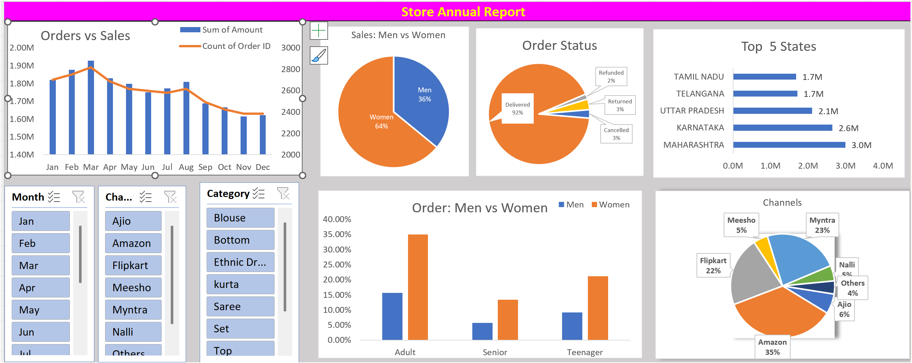

# 📊 Retail Store Data Analysis (Excel Dashboard)

## 📌 Project Overview
This project presents an **interactive Excel dashboard** that analyzes retail store data to uncover business insights.  
It focuses on sales trends, customer segmentation, order status, and regional performance.

---

## 🖼️ Dashboard Preview

---

## 🎯 Objectives
- Analyze monthly sales and order trends
- Understand customer demographics (Men vs Women)
- Evaluate order status (Delivered, Cancelled, Returned)
- Identify top-performing states
- Analyze sales contribution by different channels

---

## 🛠️ Tools & Technologies
- Microsoft Excel  
- Pivot Tables  
- Pivot Charts  
- Data Cleaning  
- Dashboard Design  

---

## 📊 Key Insights
- 📈 Sales and orders show seasonal trends across months  
- 👩 Women customers contribute higher sales compared to men  
- ✅ Majority of orders are successfully delivered  
- 🏆 Maharashtra and Karnataka are top-performing states  
- 🛒 Amazon and Flipkart dominate sales channels  

---

## 📁 Files Included
- `Retail Store Data Analysis.xlsx` → Main Excel dashboard  
- `excel_dashboard.png` → Dashboard preview image  

---

## 🚀 How to Use
1. Download the Excel file  
2. Open in Microsoft Excel  
3. Use filters (Month, Category, Channel) to explore insights  

---

## 💡 Skills Demonstrated
- Data Analysis  
- Data Visualization  
- Business Insight Generation  
- Excel Dashboarding  
- Problem Solving  

---

## 🔗 Author
**Atharv Sahare**  
📧 bsahare224@gmail.com  
🔗 [GitHub](https://github.com/atharv100analyst)

---

⭐ If you like this project, consider giving it a star!
